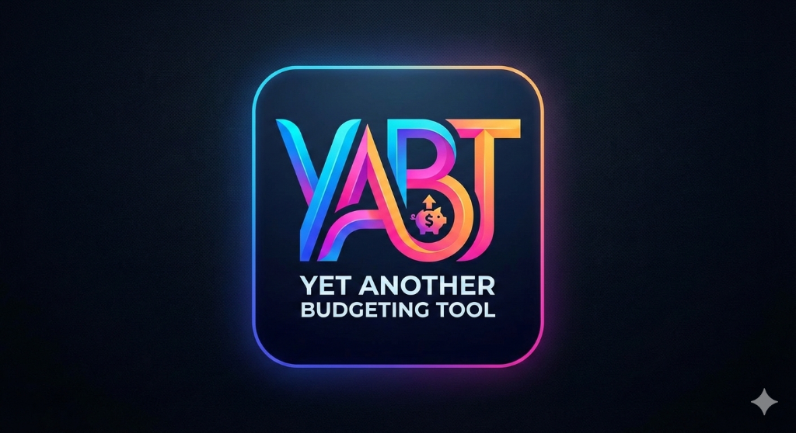

# YABT - Yet Another Budgeting Tool

<p align="center">
  
</p>

<p align="center">
  <strong>AI-powered budgeting that doesn't suck.</strong><br>
  Zero-based budgeting • AI Quick Add • Beautiful Analytics • 100% Free Forever
</p>

---

## ✨ Features

- **🤖 AI-Powered Transactions** - Just type "Spent 500 at Starbucks from HDFC" and our AI handles the rest
- **💰 Zero-Based Budgeting** - Give every rupee a job with the envelope budgeting method
- **📊 Beautiful Reports** - Track spending patterns, monthly trends, and income vs expenses
- **📈 Net Worth Tracking** - Monitor your assets and liabilities over time
- **💳 Multi-Account Support** - Checking, Savings, Credit Cards, Cash, Investments
- **🔄 Transfers** - Seamlessly move money between accounts
- **🔔 Activity Log** - Track all changes and get notifications
- **🌙 Dark Mode** - Easy on the eyes with a premium dark theme
- **📱 Responsive** - Works great on desktop and mobile

## 🛠 Tech Stack

- **Frontend**: React + TypeScript + Vite
- **Styling**: Tailwind CSS
- **Backend**: Supabase (PostgreSQL + Auth)
- **AI**: Google Gemini API (for NLP transaction parsing)
- **Containerization**: Docker

---

## 🚀 Self-Hosting Guide

### Prerequisites

- [Docker](https://docs.docker.com/get-docker/) and Docker Compose
- [Supabase Account](https://supabase.com/) (free tier works)
- [Google AI Studio Account](https://aistudio.google.com/) (for Gemini API key)

### Step 1: Clone the Repository

```bash
git clone https://github.com/bloodyburger/yabt.git
cd yabt
```

### Step 2: Set Up Supabase

1. **Create a new Supabase project** at [supabase.com](https://supabase.com)

2. **Run the database schema**:
   - Go to your Supabase Dashboard → SQL Editor
   - Copy and run the contents of `supabase/schema.sql`
   - Then run the contents of `supabase/schema_advanced.sql`

3. **Get your credentials**:
   - Go to Settings → API
   - Copy the **Project URL** (e.g., `https://xxxxx.supabase.co`)
   - Copy the **anon public key**

### Step 3: Get Gemini API Key (Optional but Recommended)

1. Go to [Google AI Studio](https://aistudio.google.com/apikey)
2. Create a new API key
3. Copy the key for the next step

> **Note**: The AI Quick Add feature requires a Gemini API key. Without it, you can still use manual transaction entry.

### Step 4: Configure Environment Variables

```bash
# Copy the example environment file
cp .env.example .env

# Edit .env with your values
nano .env  # or use any text editor
```

Update the following values in `.env`:

```env
VITE_SUPABASE_URL=https://your-project-id.supabase.co
VITE_SUPABASE_ANON_KEY=your-supabase-anon-key
VITE_GEMINI_API_KEY=your-gemini-api-key
```

### Step 5: Build and Run with Docker

```bash
# Build and start the container
docker compose up -d --build

# View logs
docker compose logs -f
```

The app will be available at **http://localhost:5177**

### Step 6: Create Your Account

1. Open http://localhost:5177
2. Click "Get Started" or "Sign Up"
3. Create an account with your email
4. Start budgeting! 🎉

---

## 🔧 Configuration Options

### Docker Compose Environment Variables

| Variable | Description | Required |
|----------|-------------|----------|
| `VITE_SUPABASE_URL` | Your Supabase project URL | ✅ Yes |
| `VITE_SUPABASE_ANON_KEY` | Your Supabase anon/public key | ✅ Yes |
| `VITE_GEMINI_API_KEY` | Google Gemini API key for AI features | ❌ Optional |

### Custom Port

To run on a different port, edit `docker-compose.yml`:

```yaml
ports:
  - "8080:80"  # Change 8080 to your preferred port
```

### Reverse Proxy (Nginx Example)

```nginx
server {
    listen 80;
    server_name budget.yourdomain.com;

    location / {
        proxy_pass http://localhost:5177;
        proxy_http_version 1.1;
        proxy_set_header Upgrade $http_upgrade;
        proxy_set_header Connection 'upgrade';
        proxy_set_header Host $host;
        proxy_cache_bypass $http_upgrade;
    }
}
```

---

## 💻 Local Development

### Prerequisites

- Node.js 18+
- npm or pnpm

### Setup

```bash
# Install dependencies
npm install

# Copy environment file
cp .env.example .env
# Edit .env with your Supabase and Gemini credentials

# Start development server
npm run dev
```

The dev server runs at **http://localhost:5173**

### Building for Production

```bash
npm run build
npm run preview
```

---

## 📁 Project Structure

```
yabt/
├── src/
│   ├── assets/         # Images and static assets
│   ├── components/     # Reusable React components
│   │   ├── common/     # Modals, inputs, shared components
│   │   └── layout/     # Sidebar, Layout wrapper
│   ├── contexts/       # React Context providers
│   ├── lib/            # Utilities (Supabase client, formatters)
│   └── pages/          # Route pages
│       └── auth/       # Login/Signup pages
├── supabase/           # Database schema files
├── Dockerfile          # Docker build configuration
├── docker-compose.yml  # Docker Compose configuration
└── .env.example        # Example environment variables
```

---

## 🗄 Database Schema

YABT uses the following main tables in Supabase:

| Table | Description |
|-------|-------------|
| `profiles` | User profiles and settings |
| `accounts` | Bank accounts, credit cards, cash |
| `transactions` | All income and expense records |
| `categories` | Budget categories |
| `category_groups` | Groups for organizing categories |
| `monthly_budgets` | Monthly budget allocations per category |
| `activity_log` | Audit trail of all changes |
| `notifications` | User notifications |

All tables have Row Level Security (RLS) enabled, ensuring users can only access their own data.

---

## 🤝 Contributing

Contributions are welcome! Please feel free to submit a Pull Request.

---

## 📄 License

This project is open source and available under the [MIT License](LICENSE).

---

## 💖 Support

YABT is 100% free and always will be. If you find it useful, consider:

- ⭐ Starring this repo
- 🐛 Reporting bugs
- 💡 Suggesting features
- ☕ [Buying us a coffee](https://yabt.app) (coming soon)

---

<p align="center">
  Made with ❤️ for people who hate complicated budgeting apps
</p>
