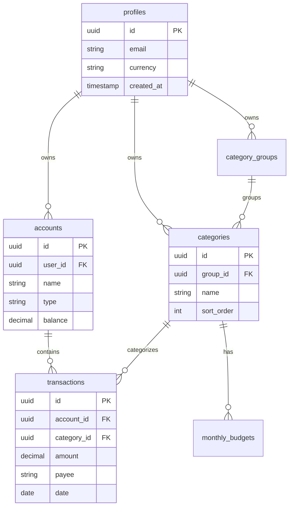

<div align="center">

# 💰 YABT - Yet Another Budgeting Tool


### AI-Powered Zero-Based Budgeting for Everyone

[](https://github.com/bloodyburger/yabt/stargazers)
[](https://github.com/bloodyburger/yabt/network/members)
[](https://github.com/bloodyburger/yabt/issues)
[](https://github.com/bloodyburger/yabt/pulls)
[](LICENSE)
[](https://github.com/sponsors/bloodyburger)

[](https://typescriptlang.org/)
[](https://reactjs.org/)
[](https://tailwindcss.com/)
[](https://supabase.com/)
[](https://docker.com/)

<br/>

[🌐 Live Demo](https://yabt.app) • [📖 Documentation](#-self-hosting-guide) • [🐛 Report Bug](https://github.com/bloodyburger/yabt/issues) • [✨ Request Feature](https://github.com/bloodyburger/yabt/issues)

</div>

---

## 📋 Table of Contents

- [About](#-about)
- [Features](#-features)
- [Architecture](#-architecture)
- [Tech Stack](#-tech-stack)
- [Self-Hosting Guide](#-self-hosting-guide)
- [Local Development](#-local-development)
- [Project Structure](#-project-structure)
- [Database Schema](#-database-schema)
- [Roadmap](#-roadmap)
- [Contributing](#-contributing)
- [Sponsors](#-sponsors)
- [License](#-license)

---

## 🎯 About

**YABT** (Yet Another Budgeting Tool) is a modern, open-source personal finance application that implements the **zero-based budgeting** methodology. Unlike traditional budgeting apps, YABT ensures that every dollar (or rupee) has a purpose, helping you take complete control of your finances.

### Why YABT?

- 🆓 **100% Free Forever** - No subscriptions, no premium tiers, no hidden costs
- 🤖 **AI-Powered** - Natural language transaction entry powered by Google Gemini
- 🔒 **Privacy-Focused** - Self-host option available; your data stays yours
- 🎨 **Beautiful UI** - Modern, responsive design with dark mode
- 🚀 **Lightning Fast** - Built with Vite and React for optimal performance
- 📱 **Mobile Ready** - Works seamlessly on all devices

### What is Zero-Based Budgeting?

Zero-based budgeting is a method where you allocate every unit of your income to specific categories until you have ₹0 left to assign. This approach ensures:

1. **Complete Visibility** - Know exactly where every rupee goes
2. **Intentional Spending** - Every expense is planned and purposeful
3. **Goal Achievement** - Allocate money to savings goals as a "bill" to yourself

---

## ✨ Features

<table>
<tr>
<td width="50%">

### 🤖 AI-Powered Quick Add
Type naturally: *"Spent 500 at Starbucks from HDFC"* and the AI parses amount, payee, and account automatically.

### 💰 Zero-Based Budgeting
Envelope-style budgeting where every rupee has a job. Budget to zero and watch your savings grow.

### 📊 Beautiful Analytics
Interactive reports showing spending by category, monthly trends, and income vs expenses.

### 📈 Net Worth Tracking
Monitor your financial progress with assets, liabilities, and net worth trends over time.

</td>
<td width="50%">

### 💳 Multi-Account Support
Track checking, savings, credit cards, cash, and investment accounts in one place.

### 🔄 Smart Transfers
Move money between accounts with automatic balance updates on both ends.

### 📝 Activity Log
Complete audit trail of all changes with timestamps and descriptions.

### 🔔 Notifications
Stay informed about important events and budget alerts.

</td>
</tr>
</table>

---

## 🏗 Architecture

```
┌─────────────────────────────────────────────────────────────────────────────┐
│                              CLIENT (Browser)                                │
│  ┌─────────────────────────────────────────────────────────────────────────┐│
│  │                        React + TypeScript + Vite                         ││
│  │  ┌──────────────┐  ┌──────────────┐  ┌──────────────┐  ┌─────────────┐  ││
│  │  │    Pages     │  │  Components  │  │   Contexts   │  │    Hooks    │  ││
│  │  │  - Budget    │  │  - Sidebar   │  │  - Auth      │  │  - useAuth  │  ││
│  │  │  - Accounts  │  │  - Modals    │  │  - Budget    │  │  - useBudget│  ││
│  │  │  - Reports   │  │  - Forms     │  │  - Settings  │  │             │  ││
│  │  │  - NetWorth  │  │  - Cards     │  │              │  │             │  ││
│  │  └──────────────┘  └──────────────┘  └──────────────┘  └─────────────┘  ││
│  └─────────────────────────────────────────────────────────────────────────┘│
└─────────────────────────────────────────────────────────────────────────────┘
                                      │
                                      │ HTTPS
                                      ▼
┌─────────────────────────────────────────────────────────────────────────────┐
│                              SUPABASE (BaaS)                                 │
│  ┌──────────────────┐  ┌──────────────────┐  ┌──────────────────────────┐  │
│  │   PostgreSQL     │  │  Authentication   │  │    Row Level Security    │  │
│  │   ───────────    │  │  ───────────────  │  │    ─────────────────     │  │
│  │  • profiles      │  │  • Email/Password │  │  • User data isolation   │  │
│  │  • accounts      │  │  • Session Mgmt   │  │  • Secure by default     │  │
│  │  • transactions  │  │  • JWT Tokens     │  │  • Policy-based access   │  │
│  │  • categories    │  │                   │  │                          │  │
│  │  • budgets       │  │                   │  │                          │  │
│  └──────────────────┘  └──────────────────┘  └──────────────────────────┘  │
└─────────────────────────────────────────────────────────────────────────────┘
                                      │
                                      │ API Call
                                      ▼
┌─────────────────────────────────────────────────────────────────────────────┐
│                          GOOGLE GEMINI AI (Optional)                         │
│  ┌─────────────────────────────────────────────────────────────────────────┐│
│  │                    Natural Language Processing                           ││
│  │        "Spent 500 at Starbucks from HDFC" → { amount: 500, ... }        ││
│  └─────────────────────────────────────────────────────────────────────────┘│
└─────────────────────────────────────────────────────────────────────────────┘
```

### Data Flow

1. **User Interaction** → React components handle user input
2. **State Management** → React Context provides app-wide state
3. **API Calls** → Supabase client handles data operations
4. **Authentication** → Supabase Auth manages user sessions
5. **Data Security** → Row Level Security ensures data isolation
6. **AI Processing** → Gemini API parses natural language (optional)

---

## 🛠 Tech Stack

| Layer | Technology | Purpose |
|-------|------------|---------|
| **Frontend** | React 18 | UI Components & Reactivity |
| **Language** | TypeScript | Type Safety & Developer Experience |
| **Build Tool** | Vite | Fast Development & Optimized Builds |
| **Styling** | Tailwind CSS | Utility-First Styling |
| **Icons** | Lucide React | Beautiful, Consistent Icons |
| **Backend** | Supabase | Database, Auth, Real-time |
| **Database** | PostgreSQL | Relational Data Storage |
| **AI** | Google Gemini | Natural Language Processing |
| **Containerization** | Docker | Consistent Deployment |
| **Routing** | React Router | Client-Side Navigation |

---

## 🚀 Self-Hosting Guide

### Prerequisites

| Requirement | Minimum Version |
|-------------|-----------------|
| Docker | 20.10+ |
| Docker Compose | 2.0+ |
| Supabase Account | Free tier |
| Gemini API Key | Optional |

### Quick Start

```bash
# 1. Clone the repository
git clone https://github.com/bloodyburger/yabt.git
cd yabt

# 2. Configure environment
cp .env.example .env
# Edit .env with your credentials

# 3. Deploy with Docker
docker compose up -d --build

# 4. Access the app
open http://localhost:5177
```

### Detailed Setup

<details>
<summary><strong>📦 Step 1: Clone Repository</strong></summary>

```bash
git clone https://github.com/bloodyburger/yabt.git
cd yabt
```
</details>

<details>
<summary><strong>🗄 Step 2: Set Up Supabase</strong></summary>

1. Create a new project at [supabase.com](https://supabase.com)
2. Navigate to **SQL Editor** in your dashboard
3. Run the following schema files in order:
   - `supabase/schema.sql` (base tables)
   - `supabase/schema_advanced.sql` (advanced features)
4. Go to **Settings → API** and copy:
   - Project URL
   - Anon/Public Key
</details>

<details>
<summary><strong>🤖 Step 3: Get Gemini API Key (Optional)</strong></summary>

1. Visit [Google AI Studio](https://aistudio.google.com/apikey)
2. Create a new API key
3. Copy the key for the next step

> Without this, manual transaction entry still works perfectly.
</details>

<details>
<summary><strong>⚙️ Step 4: Configure Environment</strong></summary>

```bash
cp .env.example .env
```

Edit `.env` with your values:
```env
VITE_SUPABASE_URL=https://your-project.supabase.co
VITE_SUPABASE_ANON_KEY=your-anon-key
VITE_GEMINI_API_KEY=your-gemini-key  # Optional
```
</details>

<details>
<summary><strong>🐳 Step 5: Deploy with Docker</strong></summary>

```bash
# Build and start
docker compose up -d --build

# Check status
docker compose ps

# View logs
docker compose logs -f

# Stop
docker compose down
```
</details>

### Configuration Reference

| Variable | Description | Required |
|----------|-------------|:--------:|
| `VITE_SUPABASE_URL` | Supabase project URL | ✅ |
| `VITE_SUPABASE_ANON_KEY` | Supabase anonymous key | ✅ |
| `VITE_GEMINI_API_KEY` | Google Gemini API key | ❌ |

### Reverse Proxy (Production)

<details>
<summary><strong>Nginx Configuration</strong></summary>

```nginx
server {
    listen 80;
    server_name budget.yourdomain.com;
    return 301 https://$server_name$request_uri;
}

server {
    listen 443 ssl http2;
    server_name budget.yourdomain.com;

    ssl_certificate /etc/letsencrypt/live/budget.yourdomain.com/fullchain.pem;
    ssl_certificate_key /etc/letsencrypt/live/budget.yourdomain.com/privkey.pem;

    location / {
        proxy_pass http://localhost:5177;
        proxy_http_version 1.1;
        proxy_set_header Upgrade $http_upgrade;
        proxy_set_header Connection 'upgrade';
        proxy_set_header Host $host;
        proxy_set_header X-Real-IP $remote_addr;
        proxy_set_header X-Forwarded-For $proxy_add_x_forwarded_for;
        proxy_set_header X-Forwarded-Proto $scheme;
        proxy_cache_bypass $http_upgrade;
    }
}
```
</details>

---

## 💻 Local Development

### Prerequisites

- Node.js 18+
- npm or pnpm
- Supabase account

### Setup

```bash
# Install dependencies
npm install

# Configure environment
cp .env.example .env
# Add your Supabase and Gemini credentials

# Start development server
npm run dev
```

Development server runs at **http://localhost:5173**

### Available Scripts

| Command | Description |
|---------|-------------|
| `npm run dev` | Start development server |
| `npm run build` | Build for production |
| `npm run preview` | Preview production build |
| `npm run lint` | Run ESLint |

---

## 📁 Project Structure

```
yabt/
├── 📂 src/
│   ├── 📂 assets/          # Static assets (logo, images)
│   ├── 📂 components/      # Reusable React components
│   │   ├── 📂 common/      # Shared components (modals, inputs)
│   │   └── 📂 layout/      # Layout components (Sidebar, Header)
│   ├── 📂 contexts/        # React Context providers
│   │   ├── AuthContext     # Authentication state
│   │   ├── BudgetContext   # Budget data & operations
│   │   └── SettingsContext # User preferences
│   ├── 📂 lib/             # Utilities & helpers
│   │   ├── supabase.ts     # Supabase client
│   │   ├── formatMoney.ts  # Currency formatting
│   │   └── formatDate.ts   # Date formatting
│   └── 📂 pages/           # Route pages
│       ├── Budget.tsx      # Main budget view
│       ├── Accounts.tsx    # Account management
│       ├── Reports.tsx     # Analytics & reports
│       ├── NetWorth.tsx    # Net worth tracking
│       └── 📂 auth/        # Authentication pages
├── 📂 supabase/            # Database schemas
├── 📄 Dockerfile           # Docker configuration
├── 📄 docker-compose.yml   # Docker Compose config
├── 📄 .env.example         # Environment template
└── 📄 package.json         # Dependencies
```

---

## 🗄 Database Schema



### Tables Overview

| Table | Purpose |
|-------|---------|
| `profiles` | User accounts and preferences |
| `accounts` | Financial accounts (bank, credit, cash) |
| `transactions` | Income and expense records |
| `categories` | Budget categories |
| `category_groups` | Category organization |
| `monthly_budgets` | Monthly allocation per category |
| `activity_log` | Audit trail |
| `notifications` | User alerts |

---

## 🗺 Roadmap

- [x] Core budgeting features
- [x] AI-powered transaction entry
- [x] Reports & Analytics
- [x] Net Worth tracking
- [x] Docker support
- [ ] 📱 iOS App
- [ ] 🤖 Android App
- [ ] 🏦 Bank sync integration
- [ ] 📊 Advanced reports
- [ ] 🎯 Savings goals
- [ ] 👥 Shared budgets
- [ ] 📤 Data export (CSV, PDF)
- [ ] 🌍 Multi-language support

---

## 🤝 Contributing

Contributions are what make the open-source community amazing! Any contributions you make are **greatly appreciated**.

1. Fork the Project
2. Create your Feature Branch (`git checkout -b feature/AmazingFeature`)
3. Commit your Changes (`git commit -m 'Add some AmazingFeature'`)
4. Push to the Branch (`git push origin feature/AmazingFeature`)
5. Open a Pull Request

### Contributors

<a href="https://github.com/bloodyburger/yabt/graphs/contributors">
  
</a>

---

## 📄 License

Distributed under the **MIT License**. See `LICENSE` for more information.

---

## 💖 Sponsors

YABT is **100% free** and always will be. Your sponsorship helps cover hosting costs and supports continued development.

<div align="center">

[](https://github.com/sponsors/bloodyburger)

</div>

### Sponsor Tiers

| Tier | Amount | Benefits |
|------|--------|----------|
| ☕ Coffee | $5/month | Name in README |
| 🍕 Pizza | $10/month | Name + priority issue support |
| 🚀 Rocket | $25/month | All above + feature request priority |
| 💎 Diamond | $50/month | All above + 1-on-1 setup support |

### Our Sponsors

<a href="https://github.com/sponsors/bloodyburger">
  
</a>

*Your name or logo could be here!*

---

## ⭐ Star History

<div align="center">

[](https://star-history.com/#bloodyburger/yabt&Date)

</div>

---

<div align="center">

**Made with ❤️ for people who hate complicated budgeting apps**

[⬆ Back to Top](#-yabt---yet-another-budgeting-tool)

</div>
